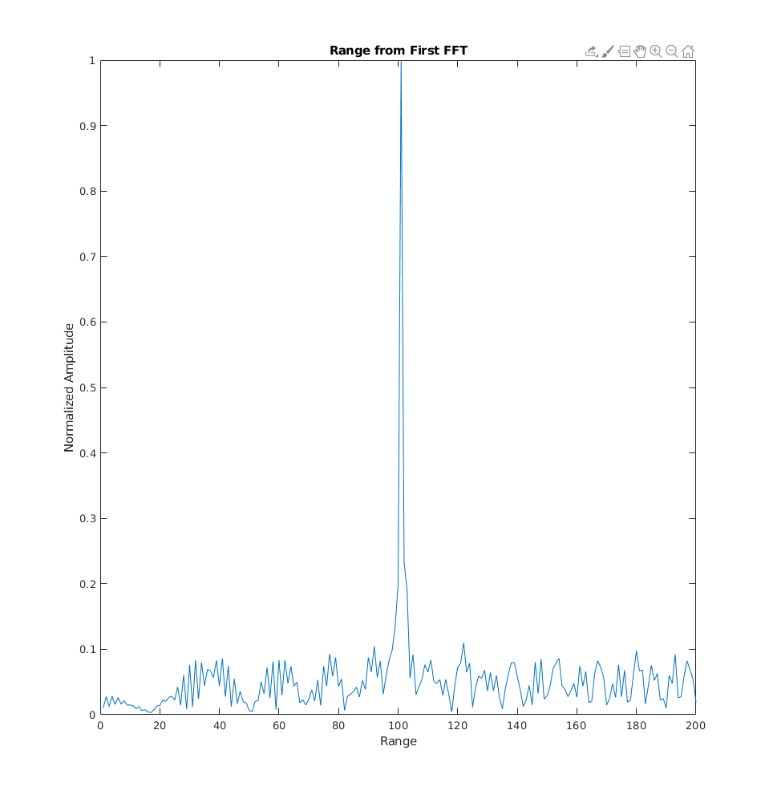
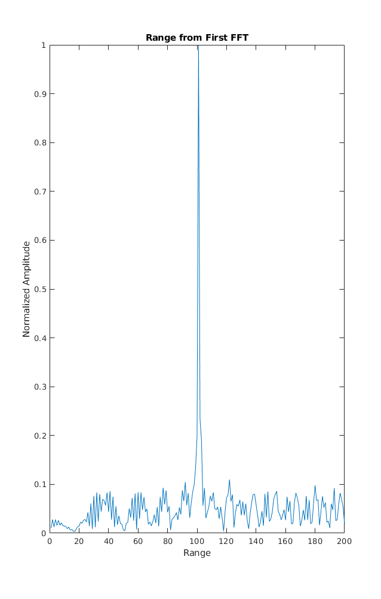
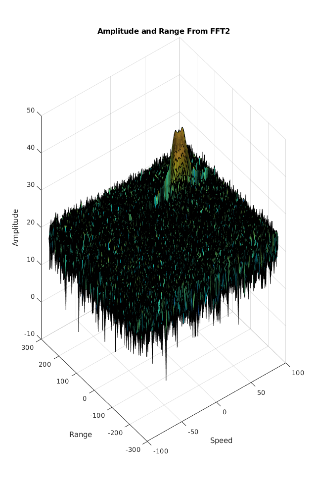
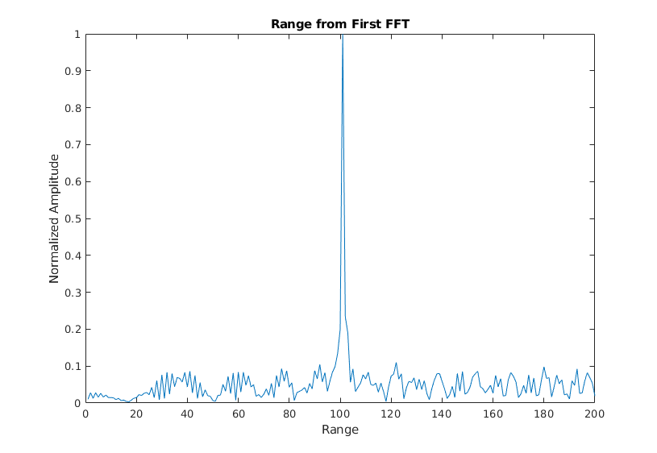
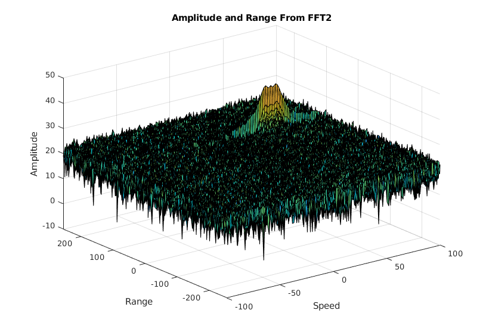
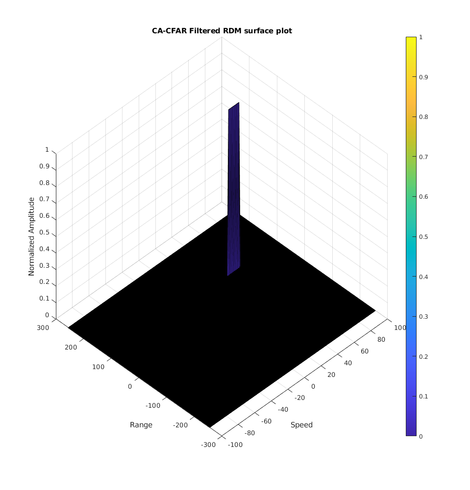

<div class="content">

Contents
--------

<div>

-   [Implementation of CFAR Steps](#2)
-   [Selection of Training, Guard cells and offsets](#2)
-   [Steps taken to supress the non-thresholded cells at the edge.](#2)
-   [Radar Specifications](#2)
-   [User Defined Range and Velocity of target](#3)
-   [FMCW Waveform Generation](#4)
-   [Signal generation and Moving Target simulation](#5)
-   [RANGE MEASUREMENT](#6)
-   [RANGE DOPPLER RESPONSE](#7)
-   [CFAR implementation](#8)

</div>

``` {.codeinput}
clear all;
clc;
```
Implementation of CFAR Steps {#2}
----------------------------
1-Determine the number of cells in each Dimension Tr and Td.Similary pick
the Number of Guard cells Gr and Gd.
2-slide the cell under test CUT across complete cell matrix.
3-for every iteration sum the signal level within all training cells,to sum convert from
logarithmic to linear using dbpow2 function.
4-average the summed values for all the training cells used.After summing convert it back to logarithmic from
linear using pow2db.
5-Further add the offset to determine the threshold.
6-Next , compare the signal under CUT against this threshold.
7-if the CUT level > threshold then assign to 1 , else assign it to 0. 
8-To keep the Map size as same as before CFAR equate all non-thresholded cells to 0.

Selection of Training, Guard cells and offsets {#2}
----------------------------------------------
-Number of training cells in range dimension (Tr)=10
-Number of training cells in doppler dimension (Td)=8
-Number of Guard cells in doppler dimension (Gr)=4
-Number of Guard cells in doppler dimension (Gd)=4


Steps taken to supress the non-thresholded cells at the edge {#2}
------------------------------------------------------------
The process above will generate a threshold block, which is smaller than the range Doppler Map as the 
CUT can't be located at the edges of the matrix. Hence, few cells will not be thresholded. to keep 
the map size same set those values to 0.
Any cell that is neither 1 or 0 assign it to 0.


Radar Specifications {#2}
--------------------

``` {.codeinput}
%%%%%%%%%%%%%%%%%%%%%%%%%%%
% Frequency of operation = 77GHz
% Max Range = 200m
% Range Resolution = 1 m
% Max Velocity = 100 m/s
%%%%%%%%%%%%%%%%%%%%%%%%%%%
```

User Defined Range and Velocity of target {#3}
-----------------------------------------

**%TODO** : define the target's initial position and velocity. Note :
Velocity remains contant

``` {.codeinput}
target_range = 100;
target_velocity = 50;

radar_max_range = 200;
radar_range_resolution = 1;
radar_max_velocity = 100;
speed_of_light = 3e8;
```

FMCW Waveform Generation {#4}
------------------------

``` {.codeinput}
% *%TODO* :
%Design the FMCW waveform by giving the specs of each of its parameters.
% Calculate the Bandwidth (B), Chirp Time (Tchirp) and slope (slope) of the FMCW
% chirp using the requirements above.

%Operating carrier frequency of Radar
fc = 77e9;             %carrier freq Hz
B = speed_of_light /(2 * radar_range_resolution);

% The sweep time can be computed based on the time needed for the signal to travel the unambiguous
% maximum range. In general, for an FMCW radar system, the sweep time should be at least
% 5 to 6 times the round trip time. This example uses a factor of 5.5.
t_sweep = 5.5;
t_chirp = t_sweep * 2 * (radar_max_range/speed_of_light);
slope = B / t_chirp;

%The number of chirps in one sequence. Its ideal to have 2^ value for the ease of running the FFT
%for Doppler Estimation.
Nd = 128;                   % #of doppler cells OR #of sent periods % number of chirps

%The number of samples on each chirp.
Nr = 1024;                  %for length of time OR # of range cells

% Timestamp for running the displacement scenario for every sample on each
% chirp
t = linspace(0,Nd*t_chirp,Nr*Nd); %total time for samples

%Creating the vectors for Tx, Rx and Mix based on the total samples input.
Tx = zeros(1, length(t)); %transmitted signal
Rx = zeros(1, length(t)); %received signal
Mix = zeros(1, length(t)); %beat signal


%Similar vectors for range_covered and time delay.
r_t = zeros(1, length(t));
td = zeros(1, length(t));
```

Signal generation and Moving Target simulation {#5}
----------------------------------------------

Running the radar scenario over the time.

``` {.codeinput}
for i = 1 : length(t)
  % *%TODO* :
  %For each time stamp update the Range of the Target for constant velocity.
  r_t(i) = target_range + (target_velocity*t(i));
  td(i) = (2 * r_t(i)) / speed_of_light;

  % *%TODO* :
  %For each time sample we need update the transmitted and
  %received signal.
  Tx(i) = cos(2 * pi * (fc * t(i) + 0.5 * slope * t(i)^2));
  Rx(i)  = cos(2 * pi * (fc * (t(i) - td(i)) + 0.5 * slope * (t(i) - td(i))^2));

  % *%TODO* :
  %Now by mixing the train_cellsansmit and Receive generate the beat signal
  %This is done by element wise matrix multiplication of train_cellsansmit and
  %Receiver Signal
  Mix(i) = Tx(i) .* Rx(i);
end
```

RANGE MEASUREMENT {#6}
-----------------

**%TODO** :

``` {.codeinput}
%reshape the vector into Nr*Nd array. Nr and Nd here would also define the size of
%Range and Doppler FFT respectively.
Mix = reshape(Mix, [Nr, Nd]);

% *%TODO* :
%run the FFT on the beat signal along the range bins dimension (Nr) and
%normalize.
sig_fft = fft(Mix, Nr);

% *%TODO* :
% Take the absolute value of FFT output
sig_fft = abs(sig_fft);
sig_fft = sig_fft ./ max(sig_fft); % Normalize

% *%TODO* :
% Output of FFT is double sided signal, but we are interested in only one side of the spectrum.
% Hence we throw out half of the samples.
sig_fft = sig_fft(1 : Nr/2-1);

%plotting the range
%figure ('Name','Range from First FFT')

% *%TODO* :
% plot FFT output
plot(sig_fft);
axis ([0 200 0 1]);
title('Range from First FFT');
ylabel('Normalized Amplitude');
xlabel('Range');
```


RANGE DOPPLER RESPONSE {#7}
----------------------

The 2D FFT implementation is already provided here. This will run a
2DFFT on the mixed signal (beat signal) output and generate a range
doppler map.You will implement CFAR on the generated RDM

``` {.codeinput}
% Range Doppler Map Generation.

% The output of the 2D FFT is an image that has reponse in the range and
% doppler FFT bins. So, it is important to convert the axis from bin sizes
% to range and doppler based on their Max values.

Mix = reshape(Mix, [Nr, Nd]);

% 2D FFT using the FFT size for both dimensions.
sig_fft2 = fft2(Mix, Nr, Nd);

% Taking just one side of signal from Range dimension.
sig_fft2 = sig_fft2(1 : Nr/2, 1 : Nd);
sig_fft2 = fftshift(sig_fft2);

range_doppler_map = abs(sig_fft2);
range_doppler_map = 10 * log10(range_doppler_map);

%use the surf function to plot the output of 2DFFT and to show axis in both
%dimensions
doppler_axis = linspace(-100, 100, Nd);
range_axis = linspace(-200, 200, Nr/2) * ((Nr/2) / 400);

% Additional views of the surface plot
figure ('Name', 'Amplitude and Range From FFT2');
surf(doppler_axis, range_axis, range_doppler_map);
title('Amplitude and Range From FFT2');
xlabel('Speed');
ylabel('Range');
zlabel('Amplitude');
```



CFAR implementation {#8}
-------------------

``` {.codeinput}
%Slide Window through the complete Range Doppler Map
% *%TODO* :
%Select the number of train_cellsaining Cells in both the dimensions.
train_cells = 10;
train_band = 8;

% *%TODO* :
%Select the number of Guard Cells in both dimensions around the Cell under
%test (CUT) for accurate estimation
guard_cells = 4;
guard_band = 4;

% *%TODO* :
% offset the threshold by SNR value in dB
offset = 1.4;

% *%TODO* :
%design a loop such that it slides the CUT across range doppler map by
%giving margins at the edges for train_cellsaining and Guard Cells.
%For every iteration sum the signal level within all the training
%cells. To sum convert the value from logarithmic to linear using db2pow
%function. Average the summed values for all of the training
%cells used. After averaging convert it back to logarithimic using pow2db.
%Further add the offset to it to determine the threshold. Next, compare the
%signal under CUT with this threshold. If the CUT level > threshold assign
%it a value of 1, else equate it to 0.


% Use RDM[x,y] as the matrix from the output of 2D FFT for implementing
% CFAR

range_doppler_map = range_doppler_map / max(range_doppler_map(:));

for row1 = train_cells + guard_cells + 1 : (Nr/2) - (train_cells + guard_cells)
  for col1 = train_band + guard_band + 1 : (Nd) - (train_band + guard_band)
    %Create a vector to store noise_level for each iteration on training cells
    noise_level = zeros(1, 1);

    for row2 = row1 - (train_cells + guard_cells) : row1 + (train_cells + guard_cells)
      for col2 = col1 - (train_band + guard_band) : col1 + (train_band + guard_band)
        if (abs(row1 - row2) > guard_cells || abs(col1 - col2) > guard_band)
          noise_level = noise_level + db2pow(range_doppler_map(row2, col2));
        end
      end
    end

    % Calculate threshold from noise average then add the offset
    threshold = pow2db(noise_level / (2 * (train_band + guard_band + 1) * 2 * (train_cells + guard_cells + 1) - (guard_cells * guard_band) - 1));
    threshold = threshold + offset;

    cell_under_test = range_doppler_map(row1,col1);

    if (cell_under_test < threshold)
      range_doppler_map(row1, col1) = 0;
    else
      range_doppler_map(row1, col1) = 1;
    end

  end
end

% *%TODO* :
% The process above will generate a thresholded block, which is smaller
%than the Range Doppler Map as the CUT cannot be located at the edges of
%matrix. Hence,few cells will not be thresholded. To keep the map size same
% set those values to 0.
range_doppler_map(range_doppler_map~=0 & range_doppler_map~=1) = 0;

% *%TODO* :
%display the CFAR output using the Surf function like we did for Range
%Doppler Response output.
figure('Name', 'CA-CFAR Filtered RDM')
surf(doppler_axis, range_axis, range_doppler_map);
colorbar;
title( 'CA-CFAR Filtered RDM surface plot');
xlabel('Speed');
ylabel('Range');
zlabel('Normalized Amplitude');
view(315, 45);
```




\
[Published with MATLAB®
R2019b](https://www.mathworks.com/products/matlab/)\

</div>
